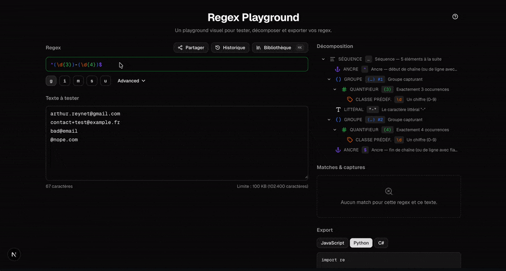

# Regex Playground

> Décompose, teste et exporte tes regex en un coup d'œil.
> Coloration syntaxique, arbre AST interactif, export JavaScript/Python/C#, exécution dans un Web Worker isolé.



[](https://regex-playground.vercel.app)
[](https://nextjs.org)
[](https://www.typescriptlang.org)
[](#license)

## ✨ Features

- **Décomposition visuelle de l'AST** — chaque token coloré, expliqué en français, avec highlighting bidirectionnel hover entre la regex source et l'arbre.
- **Exécution sécurisée dans un Web Worker** — timeout 1s pour bloquer le catastrophic backtracking, cap 10 000 matches, jamais de freeze du main thread.
- **Détection ReDoS statique** — 3 heuristiques (quantifieurs imbriqués, alternances chevauchantes, `.*` répété) qui alertent avant exécution.
- **Export cross-langage** — JavaScript, Python (`re`), C# (`Regex`) avec snippets prêts à coller et warnings 🔴🟡🔵 sur les divergences (lookbehind variable Python, flag `s` → `Singleline` C#, etc.).
- **Bibliothèque curatée** — 12 patterns courants (email, IBAN, téléphone FR, SIRET, UUID, IPv4, date ISO, status HTTP…) chargeables en 1 clic.
- **Partage via URL** — l'état complet (regex + flags + texte testé) compressé en query param `?d=` avec lz-string.
- **Historique local** — 30 dernières regex testées en localStorage, dedup MRU.
- **Cheatsheet & raccourcis** — `⌘K` bibliothèque, `⌘S` partage, `⌘↵` copier snippet, `?` cheatsheet.
- **100% client-side, zéro backend** — déployable partout en static export.
- **A11y** — `prefers-reduced-motion` respecté, navigation clavier ARIA tree dans l'AST, contraste WCAG AA.

## 🛠 Stack

- **Framework** : Next.js 16 (App Router, static export)
- **Langage** : TypeScript strict
- **Styling** : Tailwind CSS v4 + shadcn/ui (preset Radix Nova)
- **State** : Zustand (4 slices : input / execution / ui / history) + middleware `persist`
- **Animations** : Framer Motion (respecte `prefers-reduced-motion`)
- **Parsing regex** : [`@eslint-community/regexpp`](https://github.com/eslint-community/regexpp) + visiteur d'enrichissement maison
- **Compression URL** : `lz-string`
- **Tests** : Vitest + `@vitest/ui` (91 tests : types, AST enrichment, ReDoS detection, transpilers snapshots)
- **Icônes** : lucide-react
- **Notifications** : Sonner

## 🚀 Quickstart

```bash
git clone https://github.com/ArthurReynet1/regex-playground.git
cd regex-playground
nvm use   # Node 22 LTS via .nvmrc
npm install
npm run dev
```

Ouvre [http://localhost:3000](http://localhost:3000).

## 📦 Build & déploiement

```bash
npm run build       # → ./out/ (HTML/JS/CSS statiques)
npx serve out       # tester le build localement
```

Déployable sur **tout hébergeur statique** : Vercel, Netlify, Cloudflare Pages, GitHub Pages. Aucun runtime serveur requis.

### Variables d'environnement

| Variable | Description |
|---|---|
| `NEXT_PUBLIC_SITE_URL` | URL publique pour résoudre les balises `og:image` (ex: `https://regex-playground.vercel.app`). Fallback dev : `https://regex-playground.local`. |

## 🧪 Tests

```bash
npm run test        # mode watch
npm run test:run    # one-shot (CI)
npm run test:ui     # interface web Vitest
```

**91 tests** couvrent :

- Domain types & store Zustand (history slice : push, dedup MRU, cap 30 FIFO, clear)
- AST enrichment (15 fixtures happy path + 5 parseError)
- ReDoS detector (10 vrais positifs + 10 vrais négatifs)
- Transpilers (snapshots 12 fixtures × 3 langages + assertions ciblées)

## 🏗 Architecture

```
       ┌────────────── MAIN THREAD ──────────────┐
input  │                                          │
─────► │  parse (regexpp) → enrich → detectReDoS  │
       │           │              │               │
       │           ▼              ▼               │
       │     EnrichedNode    ReDoSWarning[]       │
       │                                          │
       │     ┌─ store (Zustand) ─────────────┐    │
       │     │  source / flags / text / ast  │    │
       │     │  matches / parseError         │    │
       │     │  history / activeExport       │    │
       │     └───────────────────────────────┘    │
       │           │                              │
       │           └──► postMessage ────┐         │
       └─────────────────────────────────│────────┘
                                         ▼
       ┌─────────── WEB WORKER ──────────────────┐
       │  new RegExp(source, flags + 'd')        │
       │  matchAll avec cap 10 000               │
       │  setTimeout 1s → terminate() si timeout │
       │  postMessage(matches + truncated)       │
       └──────────────────────────────────────────┘
```

Vue détaillée par dossier :

```
app/                       Next App Router
├─ layout.tsx              Metadata + providers (theme, motion, tooltip, toast)
├─ page.tsx                Compose le playground
├─ opengraph-image.tsx     OG image dynamique 1200×630
└─ icon.tsx                Favicon dynamique 32×32

components/
├─ playground/             Composants métier (RegexEditor, SyntaxInput, AstTree, …)
├─ ui/                     Primitives shadcn (button, dialog, tooltip, sonner)
└─ theme/                  ThemeProvider, MotionProvider

contexts/
├─ HoverContext.tsx        Hover range regex source (T07)
└─ MatchHoverContext.tsx   Hover index match dans texte (T08)

hooks/
├─ useAst.ts               source → AST + ReDoS warnings
├─ useRegexWorker.ts       Cycle de vie worker + timeout
├─ useShareSync.ts         Hydratation URL ↔ store
├─ useLocalHistory.ts      Push debounce 1s dans history
├─ useKeyboardShortcuts.ts Raccourcis globaux
└─ ...

lib/
├─ regex/                  parse, enrich, explain, errors-fr, redos
├─ transpilers/            ecmascript, python, csharp + common helpers
├─ workers/                regex.worker.ts (exécution isolée)
├─ share/                  encode/decode lz-string
├─ library/                12 patterns curatés
└─ cheatsheet/             Tokens regex + raccourcis (data-driven)

stores/
└─ playground.ts           Zustand store, 4 slices, persist middleware

types/
└─ regex.ts                EnrichedNode (union 10 kinds), MatchResult, etc.
```

## 🎯 Décisions techniques notables

- **AST enrichi parallèle** plutôt que mutation de l'AST regexpp brut — découple notre modèle UX (10 catégories sémantiques) de la structure interne de la lib (20+ types de nœuds).
- **Worker long-lived, recréé sur timeout** — premier spawn au mount, réutilisé à chaque exécution, terminate+respawn uniquement sur catastrophic backtracking.
- **Request ID anti-stales** — debounce + timeout asynchrones peuvent faire arriver des réponses désordonnées. Chaque postMessage porte un ID incrémental, le main thread ignore les réponses obsolètes.
- **Flag `d` (indices) forcé côté worker** — extraction des positions de groupes capturés indépendamment du toggle UX.
- **`output: 'export'` static** — pas de runtime serveur, déployable partout. Web Workers validés en static export dès T01 (smoke test).
- **`MotionConfig reducedMotion="user"` + `motion-safe:` Tailwind** — double protection pour respecter `prefers-reduced-motion`.

## 🗺 Roadmap

**MVP (v1, livré)** — T01 à T17, ~17 PRs atomiques, 91 tests.

**v2 (parking lot)**

- T18 : Génération de regex depuis exemples (heuristiques maison)
- T19 : Export Java + PHP
- T20 : Streaming matches (progressive render sur gros textes)
- T21 : Moteur PCRE WASM optionnel
- T22 : Pages SEO par pattern courant (`/patterns/email`, `/patterns/iban`…)

## License

MIT — voir [LICENSE](./LICENSE).

---

Développé par [Arthur Reynet](https://github.com/ArthurReynet1) comme projet portfolio.
